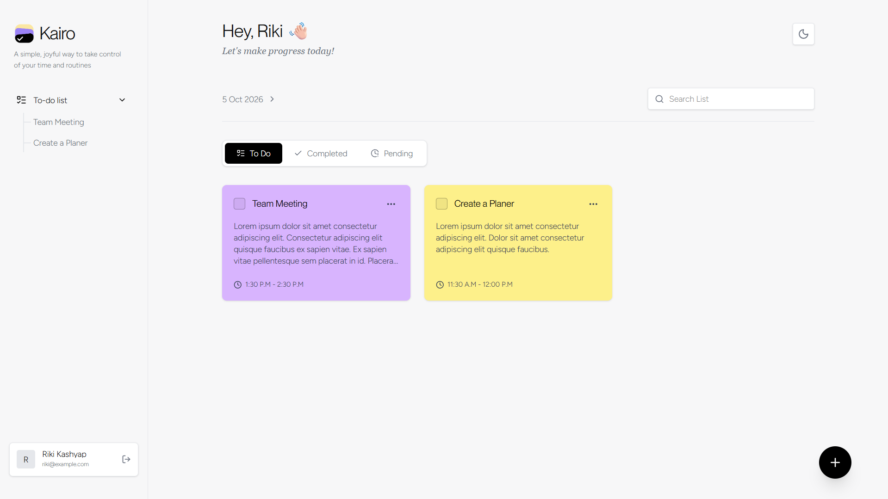
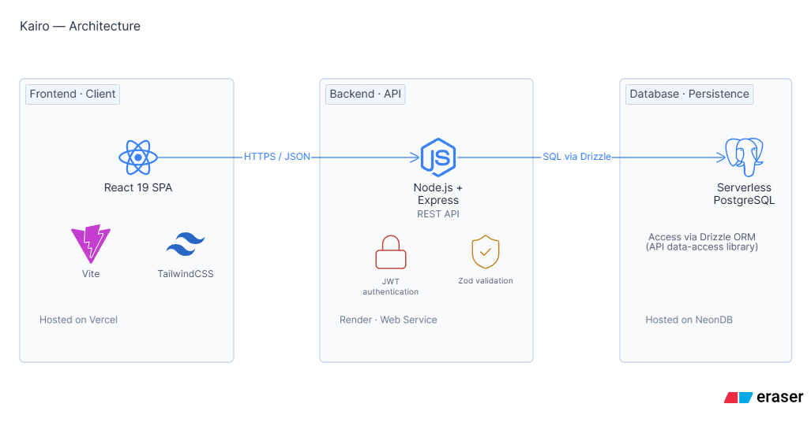
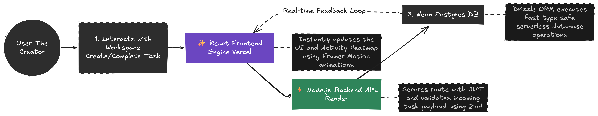

# Kairo

> A simple, joyful way to take control of your time and routines.

## What is Kairo

Kairo is a beautifully designed, full-stack workspace and task management application. Built with a focus on modern UI/UX principles, it provides a distraction-free environment to manage daily tasks, track productivity via activity heatmaps, and seamlessly switch between dark and light modes. 

Under the hood, Kairo features a robust headless Node.js backend powered by Drizzle ORM and Neon Serverless Postgres, communicating securely with a lightning-fast React + Vite frontend.

[](https://kairo-todo-app.vercel.app)

## Features

- **Hyper-Sleek UI/UX**: A clean, distraction-free interface built with TailwindCSS v4 and animated using Framer Motion for buttery-smooth interactions and swipe navigation.
- **Activity Insights Heatmap**: Track your daily productivity with a built-in GitHub-style activity heatmap that visualizes your task completion history over time.
- **Robust Authentication**: End-to-end secure, JWT-based authentication with bcrypt password hashing and API rate-limiting to prevent abuse.
- **Advanced Task Organization**: Color-code your tasks, set start and end times, and seamlessly filter them by "To Do", "Completed", or "Pending" states.
- **Serverless Database Architecture**: Built on top of Neon PostgreSQL and Drizzle ORM for instant query scaling and type-safe database operations.
- **Responsive & Mobile-First**: Optimized for all devices with a specialized mobile navigation flow, floating action buttons (FAB), and native-feeling interactions.

## Tech Stack

| Category            | Technologies                                                       |
| ------------------- | ------------------------------------------------------------------ |
| **Frontend**        | React 19, Vite, TypeScript, TailwindCSS v4, Framer Motion          |
| **Backend**         | Node.js, Express, TypeScript, Zod Validation, jsonwebtoken         |
| **Database**        | PostgreSQL (Neon DB), Drizzle ORM                                  |
| **Visualization**   | `@uiw/react-heat-map`, Lucide React Icons                          |
| **Infrastructure**  | Vercel (Frontend), Render (Backend API)                            |
| **Tooling**         | PNPM, ESLint, Prettier, Axios                                      |

## Architecture & Workflow

Kairo is split into two fully decoupled services interacting via a RESTful API.

### System Architecture


- **The Frontend (Client)**: A Single Page Application (SPA) built with React and Vite. It manages state via Context API and handles complex layout animations and route protection.
- **The Backend (API)**: A Node/Express server acting as the source of truth. It validates incoming data using Zod, authenticates requests via JWT, and performs CRUD operations via Drizzle ORM.
- **The Database**: A serverless Postgres database hosted on Neon, ensuring fast cold starts and reliable data persistence.

### Core Workflow


## Project Structure

```text
kairo/
├── frontend/             # React 19 + Vite Client Application
│   ├── src/              # UI components, pages, auth context, and API services
│   └── package.json      # Frontend-specific dependencies
├── server/               # Node.js + Express Backend API
│   ├── src/              # Controllers, routes, middleware, and Zod schemas
│   ├── drizzle/          # Database migrations and Drizzle config
│   └── package.json      # Backend-specific dependencies
└── README.md             # Project documentation (You are here)

```

## Getting Started

### Prerequisites

* Node.js >= 20
* PNPM >= 9.x
* A NeonDB (PostgreSQL) instance

### 1. Setup the Backend API

```bash
cd server
pnpm install

```

Create a `.env` file in the `server` directory:

```env
PORT=5000
CLIENT_URL="http://localhost:5173"
DATABASE_URL="your-neon-postgres-url"
JWT_SECRET="your-secure-64-char-hex-string"

```

Start the backend development server:

```bash
pnpm run dev

```

### 2. Setup the Frontend Client

Open a new terminal window:

```bash
cd frontend
pnpm install

```

Create a `.env` file in the `frontend` directory:

```env
VITE_API_URL="http://localhost:5000/api"

```

Start the frontend development server:

```bash
pnpm run dev

```

## Deployment

Kairo is highly deployable across modern cloud infrastructure:

* **Frontend (Vercel)**: Zero-config deployment. Point Vercel to the `frontend` directory and set the `VITE_API_URL` environment variable.
* **Backend (Render)**: Deploy as a Node Web Service pointing to the `server` directory. Use `pnpm install` as the build command and `pnpm run dev` as the start command.
* **Database (Neon)**: Serverless Postgres natively supported by Drizzle ORM.

## Contributing

We welcome contributions from the community. Please follow these steps:

1. Fork the repository.
2. Create a feature branch (`git checkout -b feature/amazing-feature`).
3. Commit your changes with descriptive messages.
4. Open a Pull Request.

## License

This project is licensed under the MIT License. See the `LICENSE` file for details.